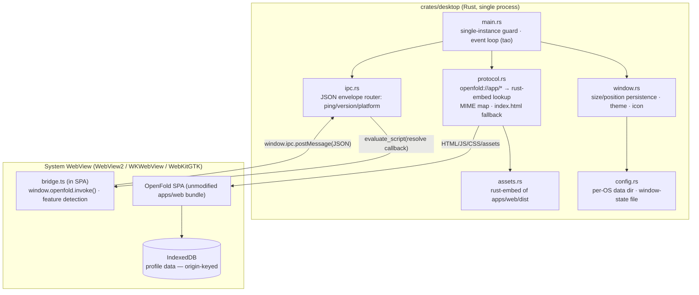
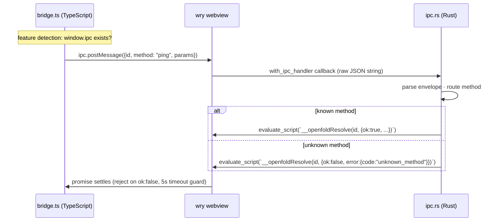

# Desktop Shell Design

**Spec**: `.specs/features/desktop-shell/spec.md`
**Status**: Approved

---

## Wrapper Technology Analysis: Dioxus vs. direct Wry (the mandated comparison)

Product constraint: an ultra-fast, low-RAM Rust web-to-desktop wrapper that is **not Tauri**. Candidates evaluated per the requirements brief:

| Criterion | Dioxus (desktop/fullstack) | Wry + tao (direct) |
| --------- | -------------------------- | ------------------- |
| What it is | A Rust UI framework (VDOM, RSX components) whose desktop renderer happens to sit on wry | The webview library itself (wry) + the windowing library (tao) — both extracted from/maintained for Tauri, usable standalone |
| Fit to our frontend | **Poor.** OpenFold's UI is a TypeScript/React SPA by explicit requirement. Dioxus's value is writing UI *in Rust*; hosting a foreign React bundle uses none of it while paying its dependency and abstraction cost | **Exact.** "Open a window, serve my bundle in a webview, give me an IPC hook" is wry's entire API surface |
| Footprint | Dioxus runtime + its dependency tree on top of wry; unused VDOM machinery shipped | Minimal: wry + tao + rust-embed ≈ the floor for a Rust webview app; everything in the binary is used |
| RAM/startup | Same webview cost; extra Rust-side runtime | Same webview cost; near-zero Rust-side overhead (one event loop) |
| Maintenance risk | Framework-coupled: Dioxus's desktop story evolves with Dioxus's priorities | Library-coupled: wry/tao are the load-bearing base of the Tauri ecosystem — conservative APIs, wide production use |
| Future IPC/SQLite (DEF-01) | Possible, through Dioxus's abstractions | Direct: `with_ipc_handler` + custom protocol are first-class wry primitives |
| Team surface | Requires Rust UI idioms (RSX, signals) nobody needs to learn for a translation layer | ~300 lines of straightforward Rust |

**Decision (STATE.md D-02): direct Wry + tao.** Dioxus would be the right call if we were writing the UI in Rust; we are explicitly not. Choosing a UI framework to *not* use its UI layer is architectural dead weight. Wry gives the identical webview + window foundation (the same one Tauri itself stands on) with nothing else in the binary — which is precisely the "translation layer" the requirements describe.

*Version note:* wry/tao APIs move; at M6 start, re-verify current crate versions and API shapes via the knowledge-verification chain (Context7/docs) before implementing (STATE.md todo).

---

## Architecture Overview

One Rust binary, one event loop, one webview. All app assets compile into the binary via `rust-embed`; a custom protocol serves them with correct MIME types from a **stable origin** (IndexedDB safety, DESK-02). The IPC bridge is a thin JSON envelope router, v1 exposing only `ping`.



### TS ↔ Rust boundary (IPC envelope)



Envelope: `{ id: string, method: string, params?: unknown }` → `{ id, ok: true, result } | { id, ok: false, error: { code, message } }`. Versioned by a `protocolVersion` field in the `ping` result. The TS side lives in `apps/web/src/desktop/bridge.ts` and is a no-op returning `available: false` in plain browsers (DESK-04 AC3).

### Origin & data stability (DESK-02 — the subtle correctness point)

- Protocol name and host are frozen: `openfold://app/…` — changing either changes the IndexedDB origin and silently orphans user data. Recorded as a **frozen constant with a warning comment and a test asserting the literal**.
- Webview user-data directory pinned per OS (spec AC1 paths) via wry's data-directory API — otherwise WebView2 defaults can vary by install context.
- Upgrade simulation test: build A writes IndexedDB, binary replaced by build B (same constants), data must be readable.

### Footprint measurement method (budgets are testable, not aspirational)

- **Binary size**: CI records release-binary bytes; assert < 10 MB (LTO + `opt-level='z'` + `strip=true` in the release profile).
- **Idle RAM**: scripted measurement 10 s after launch on each OS runner — host process RSS only (webview processes are OS-shared infrastructure, excluded per PROJECT.md wording); recorded as CI artifact, asserted < 50 MB.
- **Cold start**: time from process spawn to a `ping` roundtrip initiated by the SPA's first frame; asserted < 2 s on CI hardware.

---

## Code Reuse Analysis

### Existing Components to Leverage

| Component | Location | How to Use |
| --------- | -------- | ---------- |
| Production SPA bundle | `apps/web/dist` (built by `pnpm -w build`) | Embedded verbatim; the shell never patches the bundle |
| CI pipeline | `.github/workflows/ci.yml` | Extended with a Rust job + release-artifact job |
| Cargo workspace stub | root `Cargo.toml` (procedural-engine T1) | Hosts the crate |

### Integration Points

| System | Integration Method |
| ------ | ------------------ |
| `apps/web` | Build-order dependency only (dist embedded at compile time); plus optional `bridge.ts` (feature-detected) |
| `telemetry-analytics` | None — IndexedDB works unchanged inside the webview (D-03 payoff) |

---

## Components

### assets (rust-embed)

- **Purpose**: Compile `apps/web/dist` into the binary.
- **Location**: `crates/desktop/src/assets.rs`
- **Interfaces**: `Assets::get(path) -> Option<EmbeddedFile>`
- **Dependencies**: rust-embed; a build assertion that `dist/` exists and contains `index.html` (clear error if web build missing)

### protocol

- **Purpose**: `openfold://app/*` handler: path normalization (reject `..`), embed lookup, MIME mapping, SPA `index.html` fallback for unknown paths, immutable-cache headers.
- **Location**: `crates/desktop/src/protocol.rs`
- **Interfaces**: `fn handle(request) -> Response` (pure function over the request — fully unit-testable without a webview)
- **Dependencies**: assets
- **Reuses**: frozen origin constants module

### ipc

- **Purpose**: Envelope parse/route/respond; v1 methods: `ping` (version, platform, protocolVersion).
- **Location**: `crates/desktop/src/ipc.rs`
- **Interfaces**: `fn route(raw: &str) -> String` (pure: JSON in, JSON out — unit-testable)
- **Dependencies**: serde/serde_json

### window + config

- **Purpose**: Window creation (size/min/center/icon/theme), state persistence to the per-OS data dir (JSON file), monitor clamping, single-instance guard.
- **Location**: `crates/desktop/src/window.rs`, `crates/desktop/src/config.rs`
- **Interfaces**: `fn create_window(state: WindowState) -> Window` · `WindowState::{load, save, clamp_to_monitors}`
- **Dependencies**: tao, directories crate (per-OS paths), single-instance crate or a lock-file guard

### main

- **Purpose**: Compose everything; webview crash dialog; missing-webview detection with actionable native dialog.
- **Location**: `crates/desktop/src/main.rs`
- **Dependencies**: all above + wry

### bridge (TypeScript side)

- **Purpose**: Typed promise API over `window.ipc.postMessage` with id correlation, 5 s timeout, feature detection.
- **Location**: `apps/web/src/desktop/bridge.ts`
- **Interfaces**: `desktopBridge.available: boolean` · `invoke<T>(method, params?): Promise<T>`
- **Dependencies**: none

---

## Data Models

```typescript
// bridge.ts
interface IpcRequest { id: string; method: string; params?: unknown }
type IpcResponse<T> = { id: string; ok: true; result: T } | { id: string; ok: false; error: { code: string; message: string } }
interface PingResult { version: string; platform: 'windows' | 'macos' | 'linux'; protocolVersion: 1 }
```

```rust
// config.rs
struct WindowState { width: u32, height: u32, x: Option<i32>, y: Option<i32>, maximized: bool }
// serialized as JSON at <data_dir>/window-state.json
```

**Relationships**: `PingResult.protocolVersion` gates any future IPC methods (DEF-01 SQLite would bump it).

---

## Error Handling Strategy

| Error Scenario | Handling | User Impact |
| -------------- | -------- | ----------- |
| System webview missing/broken | Detect at startup; native dialog with per-OS guidance (WebView2 bootstrapper link, WebKitGTK package name); exit code ≠ 0 | Actionable message, never a blank window |
| Webview render process crash | Native reload-or-quit dialog | Recoverable without data loss (IndexedDB committed) |
| Second instance | Focus existing window; new process exits 0 | Single window invariant; IndexedDB race prevented |
| Corrupt window-state file | Fall back to defaults, overwrite on exit | Window opens centered once |
| Embedded asset lookup miss (non-route path) | SPA fallback for extension-less paths; 404 for asset-like paths | SPA routing works; genuinely missing assets fail loudly in dev |
| Wayland position restore unavailable | Persist size only; skip position (feature-detect) | Window centers instead of restoring position |

---

## Tech Decisions (only non-obvious ones)

| Decision | Choice | Rationale |
| -------- | ------ | --------- |
| Wrapper | Wry + tao direct (analysis above) | The frontend is React/TS; a Rust UI framework adds cost without value; wry is the minimal, production-hardened translation layer |
| Asset serving | Custom protocol + rust-embed, not a localhost HTTP server | No open port (security surface + corporate-machine friendliness), no server lifecycle, faster startup; stable origin under our control |
| Origin constants frozen + tested | Literal-asserting unit test | An innocent rename would silently wipe every user's history (origin-keyed IndexedDB) — worth a guard rail |
| Protocol/IPC as pure functions | `handle(request)`, `route(json)` | The webview is untestable in CI; pushing all logic into pure functions makes `cargo test` meaningful (TESTING.md row) |
| Host RSS budget excludes webview processes | Documented measurement script | The system webview is shared OS infrastructure (the low-RAM claim of the wry approach vs. Electron is precisely that it doesn't bundle Chromium); budget targets what we control |
| Release profile | `lto = true`, `opt-level = 'z'`, `strip = true`, `panic = 'abort'` | Standard minimal-binary recipe; asserted by the size test |
