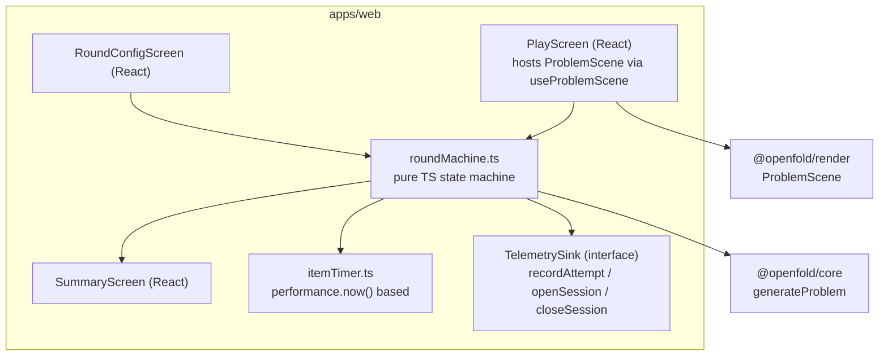
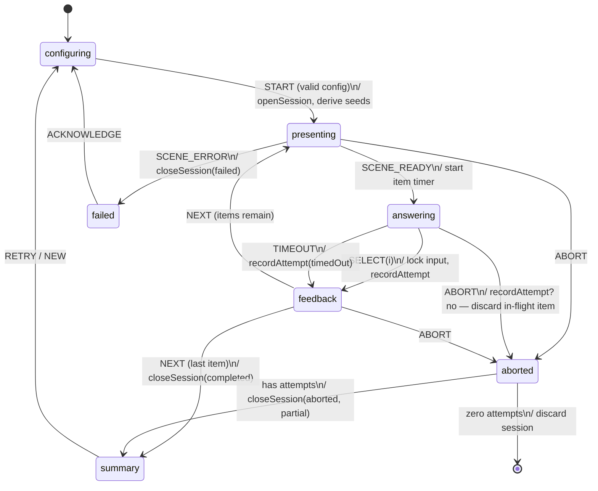

# Game Rounds Design

**Spec**: `.specs/features/game-rounds/spec.md`
**Status**: Approved

---

## Architecture Overview

This feature establishes `apps/web` (React + Vite) and implements the round loop as a **framework-agnostic state machine in plain TypeScript** (`roundMachine.ts`) with React as a thin projection. Rationale: the loop's correctness (timing, event emission, interruption) must be testable without rendering; React components subscribe to machine state via a `useSyncExternalStore` hook. Telemetry is decoupled through a `TelemetrySink` interface — this feature emits; `telemetry-analytics` implements the sink over Dexie.



### Session state machine



Key invariants (all machine-tested):

- **Timer starts at `SCENE_READY`, not at problem generation** (spec GAME-02 AC1) — mount latency never inflates `responseMs`.
- **Every transition out of `answering` records exactly one attempt** (SELECT or TIMEOUT), except ABORT which discards the in-flight item (spec GAME-05 AC1: "attempts already made" = completed items only).
- Monotonic timing: `itemTimer` wraps `performance.now()`; wall-clock is used only for the `answeredAt` display timestamp.
- **Seed derivation**: `sessionSeed = rng32()` once per round; `itemSeed[i] = hash(sessionSeed, i)` — the whole round is reproducible from `sessionSeed` (review mode, bug reports).

### Unfold mode (GAME-04)

`generateProblem` output is direction-agnostic: fold mode renders `net` as the question and `alternatives` (cubes) as options; unfold mode renders `alternatives[correctIndex]`'s cube as the question and 5 candidate **nets** as options. Candidate nets = the correct net + 4 nets whose folds are canonically distinct from the question cube. This requires one core addition — `generateUnfoldProblem(seed, params)` reusing the same modules (documented here; implemented as a game-rounds task in `packages/core` because no other feature needs it; the heuristics/canonicalizer APIs make it ~50 lines).

### Crash recovery (GAME-05 AC2)

On round start the machine writes a `pendingSession` marker via the sink; `closeSession` clears it. App boot checks for a stale marker and instructs the sink to mark that session `aborted`. No timers or beforeunload heroics — deliberately simple and reload-proof.

---

## Code Reuse Analysis

### Existing Components to Leverage

| Component | Location | How to Use |
| --------- | -------- | ---------- |
| `generateProblem`, presets, types | `packages/core` | Item generation per state machine `presenting` entry |
| `ProblemScene` full API | `packages/render` | Mounted by PlayScreen; callbacks wired to machine events |
| Demo-page interaction patterns | `packages/render/demo` | Reference for mounting/disposal in React strict mode |

### Integration Points

| System | Integration Method |
| ------ | ------------------ |
| `telemetry-analytics` | Implements `TelemetrySink`; this feature ships a no-op + in-memory sink for tests and pre-M4 builds |
| `guided-training` | `feedback` state exposes a `FeedbackSlot` render prop (problem, chosen, correct, distractorMeta) that M5 fills with explanations |

---

## Components

### roundMachine

- **Purpose**: Pure-TS state machine implementing the diagram above; owns all timing and event emission.
- **Location**: `apps/web/src/round/roundMachine.ts`
- **Interfaces**:
  - `createRoundMachine(deps: { generate: typeof generateProblem; sink: TelemetrySink; now(): number }): RoundMachine`
  - `RoundMachine = { state: Readonly<RoundState>; send(event: RoundEvent): void; subscribe(cb): Unsubscribe }`
- **Dependencies**: core (via injected `generate` — injection keeps tests hermetic)
- **Reuses**: `GenerationParams` from core

### itemTimer

- **Purpose**: Monotonic per-item timer with timeout callback; suspect-flag threshold (<300 ms).
- **Location**: `apps/web/src/round/itemTimer.ts`
- **Interfaces**: `start(limitMs | null, onTimeout)` · `stop(): { responseMs: number; suspect: boolean }`
- **Dependencies**: `performance.now` (injected for tests)

### TelemetrySink (interface) + InMemorySink

- **Purpose**: Decoupling contract to storage; test/no-op implementations.
- **Location**: `apps/web/src/telemetry/TelemetrySink.ts`
- **Interfaces**:
  - `openSession(cfg: SessionConfig): Promise<SessionId>`
  - `recordAttempt(a: AttemptRecord): Promise<void>`
  - `closeSession(id, outcome: 'completed'|'aborted'|'failed', summary: SessionSummary | null): Promise<void>`
  - `getPendingSession(): Promise<SessionId | null>` · `setPendingSession(id | null): Promise<void>`
- **Dependencies**: none (interface); types shared with `telemetry-analytics` design

### RoundConfigScreen / PlayScreen / SummaryScreen

- **Purpose**: React projections of machine states; PlayScreen hosts the Three.js scene and wires callbacks.
- **Location**: `apps/web/src/screens/{RoundConfig,Play,Summary}Screen.tsx`
- **Interfaces**: standard React components consuming `useRoundMachine()`
- **Dependencies**: roundMachine, `useProblemScene` hook
- **Reuses**: `ProblemScene` (render), last-config persistence via sink settings

### useProblemScene

- **Purpose**: React hook owning ProblemScene lifecycle (mount/dispose/strict-mode safety).
- **Location**: `apps/web/src/hooks/useProblemScene.ts`
- **Interfaces**: `useProblemScene(ref, problem, opts): { scene: ProblemScene | null; error: Error | null }`
- **Dependencies**: `@openfold/render`

### App shell (infra, Phase 1)

- **Purpose**: Vite + React scaffold, router (config/play/summary as machine-driven views, no URL routing needed in v1 — a single route with view switching), theming baseline.
- **Location**: `apps/web/src/{main.tsx,App.tsx}` + configs

---

## Data Models

```typescript
interface SessionConfig {
  difficulty: 'easy' | 'medium' | 'hard'
  problemCount: number          // 5..50
  timeLimitMs: number | null    // 10_000..120_000 | null = unlimited
  mode: 'fold' | 'unfold' | 'mixed'
  sessionSeed: number
}

interface AttemptRecord {
  sessionId: string
  itemIndex: number
  seed: number                  // itemSeed — regenerates the exact problem
  mode: 'fold' | 'unfold'
  difficulty: SessionConfig['difficulty']
  chosenIndex: number | null    // null = timeout
  correctIndex: number
  correct: boolean
  timedOut: boolean
  suspect: boolean
  responseMs: number
  answeredAt: number            // epoch ms, display only
}

interface SessionSummary {
  attempts: number
  correct: number
  accuracy: number              // 0..1
  meanResponseMs: number
  medianResponseMs: number
}
```

**Relationships**: `AttemptRecord`/`SessionConfig`/`SessionSummary` are the shared vocabulary with `telemetry-analytics` (its Dexie schema persists exactly these shapes plus keys).

---

## Error Handling Strategy

| Error Scenario | Handling | User Impact |
| -------------- | -------- | ----------- |
| Scene mount failure (no WebGL) | Machine → `failed`; session closed as `failed`; typed message shown | Clear guidance instead of a dead screen |
| `generateProblem` throws (should be unreachable post-M1) | Skip to next itemSeed, log; after 3 consecutive failures → `failed` | At worst one skipped item |
| Sink write failure (quota, private mode) | Attempts buffered in memory; retry on next transition; summary still shown; warning banner | Round playable even if storage is broken |
| Timeout races SELECT (same tick) | Machine resolves deterministically: first event wins, second is ignored (tested) | No double-recorded attempts |

---

## Tech Decisions (only non-obvious ones)

| Decision | Choice | Rationale |
| -------- | ------ | --------- |
| State management | Hand-rolled typed machine + `useSyncExternalStore`, not Redux/XState/Zustand | The domain is one machine with 7 states; a library adds dependency surface without covering the custom timing semantics. Machine is trivially unit-testable with fake `now()` |
| Timer semantics | Start at `SCENE_READY`, monotonic clock, in-machine (not in React effects) | React render timing must never leak into psychometric measurements |
| No URL router in v1 | Single route, machine-driven views | Rounds are modal flows; deep-linking mid-round is meaningless and complicates abort semantics |
| `generateUnfoldProblem` lives in core but is tasked here | Implementation in `packages/core/src/unfold.ts` | Geometry/canonicalization belongs in core (D-04); scheduling it here keeps M1 lean since only M3 needs it |
| Crash recovery via pending-session marker | Boot-time reconciliation, no `beforeunload` | `beforeunload` is unreliable in webviews; boot reconciliation is deterministic |
