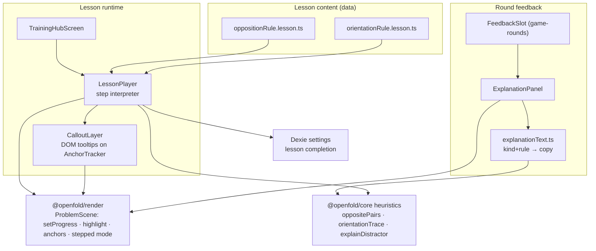

# Guided Training Design

**Spec**: `.specs/features/guided-training/spec.md`
**Status**: Approved

---

## Architecture Overview

The tutoring layer is a **data-driven lesson player**: lessons are declarative step lists (`LessonScript`), and a single `LessonPlayer` component interprets them against a live `ProblemScene`. Each step declares the fold progress, highlights, anchored callouts, and optional practice interaction — so adding a lesson is pure content (spec success criterion). Explanations in rounds reuse the same primitives via a lighter `ExplanationPanel` mounted in game-rounds' `FeedbackSlot`. All rule facts come from `@openfold/core` heuristics (PROC-05); this feature contains **zero geometry math**.



### Lesson step model

A step is a pure description; the player is the only stateful part. Backward navigation replays the step's declaration from scratch (spec TUTR-01 AC5 — steps as pure functions of index).

```typescript
interface LessonScript {
  id: string; title: string; estMinutes: number
  makeProblem(rng: Rng): DecoratedNet          // procedural per lesson run — content never hardcodes geometry
  steps: LessonStep[]
}

type LessonStep =
  | { kind: 'exposition'
      foldProgress: number                      // 0..1, stepped-mode pose
      highlights: HighlightTarget[]
      callouts: Array<{ anchor: AnchorKey; text: TextTemplate }> }
  | { kind: 'practice'
      prompt: TextTemplate
      makeQuestion(net: DecoratedNet): PracticeQuestion   // uses core heuristics to build+score
      justification: 'oppositePairs' | 'orientationTrace' }
```

`TextTemplate` interpolates computed facts (face labels, orientation deltas) — copy lives with the step, facts come from core at runtime. This is what guarantees explanations never hallucinate geometry: templates can only reference values the heuristics API returned for the actual net.

### Explanation mapping (TUTR-03)

| Distractor kind | Rule cited | Facts used | Highlights |
| --------------- | ---------- | ---------- | ---------- |
| `opposite-swap` | Opposition Rule | `explainDistractor` witnessing pair; `syntactic` flag picks strip-pattern vs. fold-based phrasing | pair on net + on chosen cube |
| `adjacent-permutation` | Opposition Rule (adjacency corollary) | affected face cycle | cycle faces on both |
| `symbol-rotation` | Orientation Rule | `orientationTrace` of the affected face; actual vs. shown delta | affected face + its fold path hinges |
| `symbol-mirror` | Orientation Rule (chirality note) | affected face; mirror flag | affected face on both |
| correct answer | compact reminder | rule of the hardest surviving distractor | none |
| timeout | correct answer + strategy hint | fastest-eliminating rule for this item | correct cube |

---

## Code Reuse Analysis

### Existing Components to Leverage

| Component | Location | How to Use |
| --------- | -------- | ---------- |
| `oppositePairs` / `orientationTrace` / `explainDistractor` | `packages/core/src/heuristics.ts` (PROC T12) | Sole source of rule facts |
| `ProblemScene.setProgress` + stepped mode | render T5/T10 | Step poses; reduced-motion compliance for free |
| `AnchorTracker` + `highlight` | render T9 | Callout positioning + face emphasis |
| `FeedbackSlot` render prop | game-rounds T8 | Mount point for ExplanationPanel — zero changes to round flow |
| `useProblemScene` | game-rounds T6 | LessonPlayer scene lifecycle |
| Dexie `settings` table | telemetry T1 | Lesson completion persistence |
| `generateNet`/`prng` | core | `makeProblem` procedural lesson geometry |

### Integration Points

| System | Integration Method |
| ------ | ------------------ |
| `game-rounds` | ExplanationPanel passed into `FeedbackSlot`; receives `(problem, chosenIndex, correctIndex, distractorMeta, outcome)` |
| App shell | TrainingHub added as a top-level view (pattern from telemetry T8) |

---

## Components

### CalloutLayer

- **Purpose**: DOM tooltips/badges pinned to `AnchorKey`s, auto-hiding when anchor reports occluded; arrow direction from screen quadrant.
- **Location**: `apps/web/src/training/CalloutLayer.tsx`
- **Interfaces**: `<CalloutLayer scene={scene} callouts={ResolvedCallout[]} />`
- **Dependencies**: AnchorTracker subscription API
- **Reuses**: render T9

### LessonPlayer

- **Purpose**: Interpret a `LessonScript`: mount scene, apply step declarations (pose/highlights/callouts), handle practice scoring, step navigation (keyboard: ←/→), completion emission.
- **Location**: `apps/web/src/training/LessonPlayer.tsx`
- **Interfaces**: `<LessonPlayer script={LessonScript} onComplete={() => void} resumeAt?: number />`
- **Dependencies**: useProblemScene, CalloutLayer, core heuristics
- **Reuses**: everything listed above

### lessons (content)

- **Purpose**: The two v1 `LessonScript`s per spec TUTR-01/02, each ~6–9 steps ending in a practice step.
- **Location**: `apps/web/src/training/lessons/{oppositionRule,orientationRule}.lesson.ts`
- **Interfaces**: `export const lesson: LessonScript`
- **Dependencies**: core (`generateNet`, heuristics) — no render/react imports (pure data + functions)

### explanationText + ExplanationPanel

- **Purpose**: Map `(distractorMeta, outcome)` → rule citation + interpolated copy + highlight targets (table above); render it in the feedback slot with simultaneous net/cube highlighting.
- **Location**: `apps/web/src/training/explanationText.ts`, `apps/web/src/training/ExplanationPanel.tsx`
- **Interfaces**:
  - `buildExplanation(problem: FoldProblem, chosen: number | null, outcome: AttemptOutcome): Explanation`
  - `<ExplanationPanel explanation={Explanation} scene={ProblemScene} />`
- **Dependencies**: core `explainDistractor`; render highlight/anchors

### TrainingHubScreen

- **Purpose**: Lesson list with completion badges, resume/restart, entry into LessonPlayer.
- **Location**: `apps/web/src/screens/TrainingHubScreen.tsx`
- **Interfaces**: React screen
- **Dependencies**: lessons registry, Dexie settings

---

## Data Models

```typescript
interface PracticeQuestion {
  prompt: string
  options: string[]                 // e.g. face labels or orientation choices
  correctIndex: number
  justify(): JustificationView      // trace/pairs data for the post-answer replay
}

interface Explanation {
  rule: 'opposition' | 'orientation' | null
  headline: string
  body: string                      // interpolated, geometry-grounded
  highlights: HighlightTarget[]
  anchors: Array<{ key: AnchorKey; label: string }>
}

interface LessonProgressRow {       // stored in Dexie settings.uiPrefs.lessons
  lessonId: string; completed: boolean; lastStep: number; completedAt: number | null
}
```

**Relationships**: `Explanation` derives entirely from `FoldProblem.distractorMeta` + core heuristics; `LessonProgressRow` persists via telemetry's settings table.

---

## Error Handling Strategy

| Error Scenario | Handling | User Impact |
| -------------- | -------- | ----------- |
| Anchor unavailable (face occluded/off-screen) | CalloutLayer hides that callout; step remains navigable | Slightly less annotation, never a block |
| Heuristics API returns non-syntactic opposition pair | `explanationText` selects fold-based phrasing (spec edge case) | Always-truthful explanation |
| Scene mount failure inside a lesson | Same typed error path as rounds; hub shows retry | Consistent failure UX |
| Corrupt lesson progress row | Reset that lesson to not-completed; log | Worst case: redo a 5-minute lesson |

---

## Tech Decisions (only non-obvious ones)

| Decision | Choice | Rationale |
| -------- | ------ | --------- |
| Lessons as declarative data interpreted by one player | `LessonScript` + `LessonPlayer` | Spec requires adding lessons content-only; also makes steps trivially testable (pure declarations) |
| Lesson geometry is procedural per run (`makeProblem(rng)`) | Not fixed fixtures | Learners revisiting a lesson see fresh nets — the rule generalizes instead of being memorized with one picture; tests pin the rng seed |
| Callouts as DOM over canvas (CalloutLayer) | Not in-scene sprites | Accessibility (real text, screen-readable), styling consistency, and the render layer's anchor API was designed for exactly this ownership split (render design decision) |
| Explanation copy templates co-located with mapping table | `explanationText.ts` | Single reviewable file defines every sentence the tutor can say; translation-ready (DEF-04) |
| Practice scoring inside lesson steps via core | `makeQuestion` closures | No parallel scoring engine; the same math that generates items grades practice |
