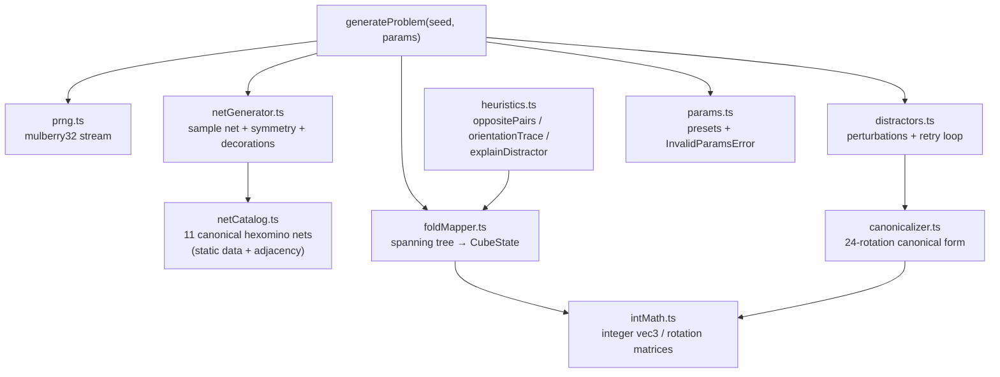

# Procedural Engine Design

**Spec**: `.specs/features/procedural-engine/spec.md`
**Status**: Approved

---

## Architecture Overview

`packages/core` is a zero-dependency (runtime) pure-TypeScript library. It has four cooperating modules behind one façade (`generateProblem`), plus a heuristics module consumed by `guided-training`. Nothing in this package imports Three.js or touches the DOM (STATE.md D-04); it defines its own minimal integer/rational linear algebra so results are exact (no floating-point drift → cross-engine determinism, PROC-01 AC4).



### The mathematical procedural strategy (net → cube mapping)

This section is normative; `foldMapper.ts` implements it exactly.

**1. Net representation.** A net is 6 faces on the integer grid ℤ²: `faces[i] = {cell: [col, row], symbol, symbolRotation}`. The **adjacency graph** G has faces as nodes; an edge connects faces whose cells are 4-neighbors. Every valid cube net's G is connected with exactly 5 or more edges; we use a **spanning tree** T of G (BFS from a deterministic root — the lexicographically smallest cell). Each tree edge is a **hinge**.

**2. Fold as rigid-motion composition.** Embed the unfolded net in the z = 0 plane, one face per unit cell. Folding rotates each subtree by **+90° about its hinge line** (the shared edge, an axis parallel to x or y at integer offsets). A face's final pose is the left-to-right composition of the hinge rotations on its root-path in T:

```
pose(f) = R(h₁) · R(h₂) · … · R(hₖ)   where h₁…hₖ = hinges from root to f
```

Each `R(h)` is a rotation of ±90° about a grid-aligned line — representable exactly as an integer 3×3 rotation matrix plus integer translation (a screw motion on ℤ³). All arithmetic stays in ℤ: **no floats anywhere in the fold**, hence bit-identical results on every JS engine.

**3. Extracting CubeState.** After composition, each face has an integer center `c(f)` and outward normal `n(f)`. Translate so cube center = origin; then `n(f)` is one of the 6 axis unit vectors → cube face assignment. The symbol's in-plane orientation is recovered by transporting the face's local "up" vector through `pose(f)` and expressing it in that cube face's canonical 2D frame → rotation ∈ {0°, 90°, 180°, 270°}. Output:

```
CubeState = { faces: Record<'+x'|'-x'|'+y'|'-y'|'+z'|'-z', { symbol, rotation }> }
```

**4. Fold replay for rendering.** `foldNet` also emits `FoldPlan = { root, hinges: Array<{ faceId, parentFaceId, axis, pivot }> }` in tree order. `packages/render` builds its THREE.Group hierarchy from this plan and animates each hinge angle 0→90°; at angle = 90° the render-layer pose equals the core-layer pose by construction (single source of truth, REND spec depends on this).

**5. Rotation-group canonicalization.** The cube's rotation group has 24 elements, enumerable as integer matrices (generated by the two coordinate 90° rotations). `canonicalize(cube)`: apply all 24 rotations — each permutes face assignments and adjusts in-plane rotations by a face-dependent, precomputed delta — serialize each resulting state to a fixed-order string, return the lexicographic minimum. Two cubes are rotation-equivalent **iff** canonical strings are equal (PROC-04 AC3). Cost: 24 × 6 small ops ≈ microseconds.

**6. Distractor sampling.** Deterministic loop drawing perturbation types from the seeded stream according to the difficulty mix (PROC-04 AC4), applying the perturbation, canonicalizing, and rejecting collisions with the answer or accepted distractors. Bounded at 32 retries, then decoration redraw (PROC-07).

### Difficulty Model

| Parameter | easy | medium | hard |
| --------- | ---- | ------ | ---- |
| Symbol tier | distinct solid glyphs (no rotational ambiguity) | mixed | orientation-sensitive glyphs (arrows, L-shapes, flags) |
| Decorated faces | 3 (rest blank) | 4–5 | 6 |
| Distractor mix | ≥3 structural (`opposite-swap`, `adjacent-permutation`) | balanced | ≥2 subtle (`symbol-rotation`, `symbol-mirror`) |
| Net bias | the 6 "row-of-four" nets (familiar) | uniform over 11 | uniform over 11 |

Symbols are identified by id + symmetry class (`asymmetric`, `2-fold`, `4-fold`); the canonicalizer consults the symmetry class so that, e.g., a 180°-rotated `2-fold` symbol compares equal — this is what makes edge-case detection (spec Edge Cases) sound rather than heuristic.

---

## Code Reuse Analysis

Greenfield package — nothing to reuse yet; this package **is** the reuse target for every other feature.

### Integration Points

| System | Integration Method |
| ------ | ------------------ |
| `packages/render` | Imports `FoldProblem`, `FoldPlan`, `CubeState` types + consumes `foldNet` output; never re-derives folding math |
| `apps/web` (game-rounds) | Calls `generateProblem`; passes `seed` to telemetry |
| `guided-training` | Calls `heuristics.ts` API (PROC-05) |
| `telemetry-analytics` | Stores `(seed, params)`; review mode regenerates via `generateProblem` |

---

## Components

### netCatalog

- **Purpose**: Static, verified data for the 11 canonical hexomino cube nets with adjacency graphs.
- **Location**: `packages/core/src/netCatalog.ts`
- **Interfaces**:
  - `CANONICAL_NETS: readonly CanonicalNet[]` — 11 entries: cells, adjacency, symmetry group order
  - `normalizeNet(cells: Cell[]): string` — canonical key of a polyomino under D₄ symmetry (used by tests to verify catalog completeness)
- **Dependencies**: none
- **Reuses**: —

### prng

- **Purpose**: Deterministic 32-bit PRNG stream (mulberry32) with derived sub-streams.
- **Location**: `packages/core/src/prng.ts`
- **Interfaces**:
  - `createRng(seed: number): Rng` where `Rng = { next(): number; int(maxExclusive: number): number; pick<T>(arr: readonly T[]): T; fork(label: string): Rng }`
- **Dependencies**: none. `fork` hashes the label into the state so generation stages (net / decoration / distractors) draw from independent streams — inserting a draw in one stage cannot silently shift another (protects determinism across refactors).

### intMath

- **Purpose**: Exact integer 3-vector and 3×3 rotation-matrix arithmetic; the 24 cube rotation matrices.
- **Location**: `packages/core/src/intMath.ts`
- **Interfaces**:
  - `IVec3`, `IMat3` types; `mul`, `apply`, `ROTATIONS_24: readonly IMat3[]`
  - `hingeRotation(axis: 'x'|'y', pivot: IVec3, sign: 1|-1): ScrewMotion` and `composeScrew(a, b)`
- **Dependencies**: none
- **Reuses**: — (Three.js `Quaternion` is deliberately NOT used here: floats break cross-engine determinism; Three.js consumes the exact results downstream)

### netGenerator

- **Purpose**: Sample net + planar symmetry + face decorations per difficulty params.
- **Location**: `packages/core/src/netGenerator.ts`
- **Interfaces**:
  - `generateNet(rng: Rng, params: GenerationParams): DecoratedNet`
- **Dependencies**: netCatalog, prng, params
- **Reuses**: —

### foldMapper

- **Purpose**: The normative net→cube fold (algorithm above).
- **Location**: `packages/core/src/foldMapper.ts`
- **Interfaces**:
  - `foldNet(net: DecoratedNet): { cube: CubeState; plan: FoldPlan }`
- **Dependencies**: intMath
- **Reuses**: —

### canonicalizer

- **Purpose**: Canonical form under the 24-element rotation group, symbol-symmetry aware.
- **Location**: `packages/core/src/canonicalizer.ts`
- **Interfaces**:
  - `canonicalize(cube: CubeState): string`
  - `areEquivalent(a: CubeState, b: CubeState): boolean`
- **Dependencies**: intMath
- **Reuses**: —

### distractors

- **Purpose**: Typed perturbations + deterministic rejection sampling of 4 valid distractors.
- **Location**: `packages/core/src/distractors.ts`
- **Interfaces**:
  - `generateDistractors(cube: CubeState, rng: Rng, params: GenerationParams): Distractor[]` where `Distractor = { cube: CubeState; kind: PerturbationKind; affectedFaces: FaceId[] }`
- **Dependencies**: canonicalizer, prng
- **Reuses**: —

### heuristics

- **Purpose**: Rule facts for tutoring (PROC-05).
- **Location**: `packages/core/src/heuristics.ts`
- **Interfaces**:
  - `oppositePairs(net: DecoratedNet): OppositePair[]`
  - `orientationTrace(net: DecoratedNet, faceId: FaceId): HingeStep[]`
  - `explainDistractor(net: DecoratedNet, d: Distractor): RuleExplanation`
- **Dependencies**: foldMapper
- **Reuses**: foldMapper output (never re-derives geometry)

### params / index (façade)

- **Purpose**: Presets, validation (PROC-06), and the public `generateProblem` orchestration (PROC-01).
- **Location**: `packages/core/src/params.ts`, `packages/core/src/index.ts`
- **Interfaces**:
  - `expandPreset(name: 'easy'|'medium'|'hard'): GenerationParams`
  - `generateProblem(seed: number, params: GenerationParams | PresetName): FoldProblem`
- **Dependencies**: all above

---

## Data Models

```typescript
type FaceId = 0 | 1 | 2 | 3 | 4 | 5
type CubeFace = '+x' | '-x' | '+y' | '-y' | '+z' | '-z'
type SymbolSymmetry = 'asymmetric' | '2-fold' | '4-fold'
type PerturbationKind = 'opposite-swap' | 'symbol-rotation' | 'symbol-mirror' | 'adjacent-permutation'

interface DecoratedNet {
  netId: number                     // index into CANONICAL_NETS
  symmetryOp: number                // element of D4 applied to the canonical layout
  faces: Array<{
    id: FaceId
    cell: [number, number]          // grid coords after symmetryOp
    symbol: { glyphId: string; symmetry: SymbolSymmetry } | null
    symbolRotation: 0 | 90 | 180 | 270
  }>
  adjacency: Array<[FaceId, FaceId]>
}

interface CubeState {
  faces: Record<CubeFace, { glyphId: string | null; symmetry: SymbolSymmetry; rotation: 0 | 90 | 180 | 270 }>
}

interface FoldPlan {
  rootFace: FaceId
  hinges: Array<{ faceId: FaceId; parentFaceId: FaceId; axis: 'x' | 'y'; pivot: [number, number, number]; sign: 1 | -1 }>
}

interface FoldProblem {
  seed: number
  params: GenerationParams
  net: DecoratedNet
  plan: FoldPlan
  alternatives: CubeState[]         // length 5
  correctIndex: number
  distractorMeta: Array<{ index: number; kind: PerturbationKind; affectedFaces: FaceId[] }>
}
```

**Relationships**: `FoldProblem` is the sole cross-package contract; `telemetry-analytics` persists only `(seed, params)` and regenerates the rest.

---

## Error Handling Strategy

| Error Scenario | Handling | User Impact |
| -------------- | -------- | ----------- |
| Invalid params (range, unknown preset, bad seed) | Throw typed `InvalidParamsError` at the façade before any generation | UI shows validation message; never reaches a round |
| Distractor sampler exhausts 32 retries | Redraw decorations deterministically (same seed stream), max 8 redraws, then throw `GenerationError` | Practically unreachable (fuzz-verified < 0.1% redraw rate); round loop skips to next seed if ever thrown |
| Degenerate decoration (all-identical symmetric symbols) | Rejected inside netGenerator before folding | None — invisible redraw |

---

## Tech Decisions (only non-obvious ones)

| Decision | Choice | Rationale |
| -------- | ------ | --------- |
| Fold math representation | Integer screw motions, not Three.js quaternions | Bit-exact determinism across V8/JSC (spec success criterion); floats would need epsilon comparisons in the canonicalizer |
| PRNG | mulberry32 + label-forked sub-streams | 32-bit, trivially portable, no BigInt; forking isolates generation stages against refactor-induced seed drift |
| Rotation-equivalence check | Full 24-element enumeration | O(24·6) is negligible; a clever invariant-based hash would risk false equivalences with symmetric symbols |
| Catalog is static data, tests verify it | Hand-encoded 11 nets + a test that regenerates all hexomino cube nets by brute force and compares | Runtime pays zero enumeration cost; correctness still machine-checked |
| Property-based testing | fast-check, dev-dependency only | Invariants marked **[PBT]** in spec are combinatorial — example-based tests can't cover 11 nets × 8 symmetries × decoration space |
