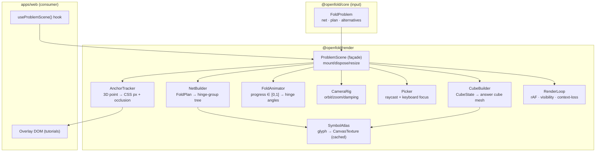
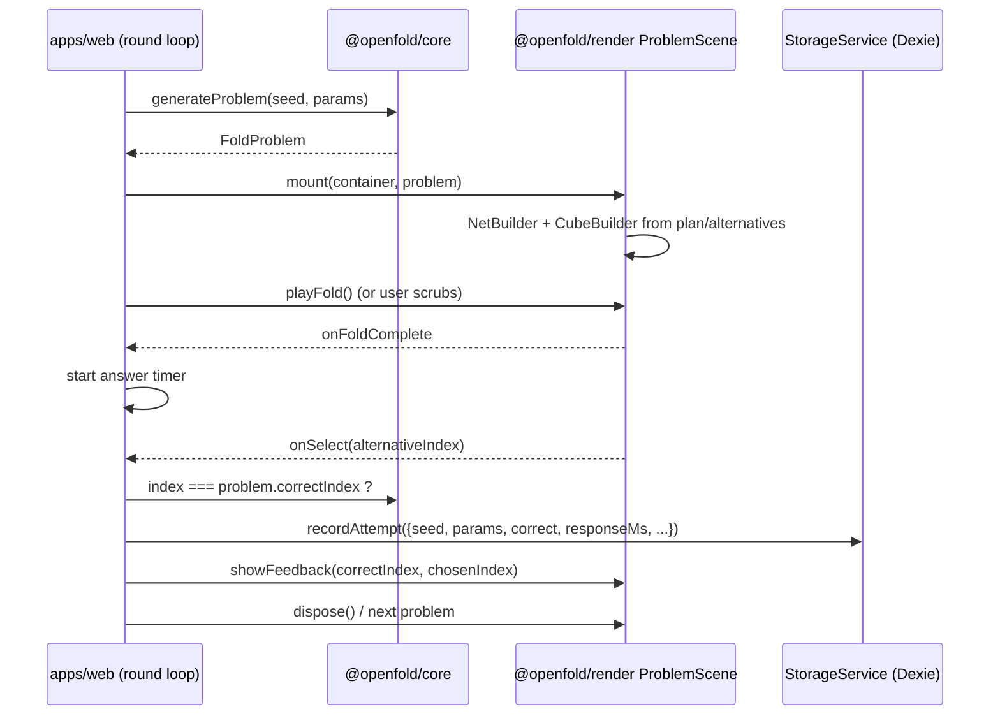

# 3D Rendering & Animation Design

**Spec**: `.specs/features/rendering-3d/spec.md`
**Status**: Approved

---

## Architecture Overview

`packages/render` is an imperative Three.js library (no React). Its central idea: **the scene graph mirrors the core's `FoldPlan` spanning tree**. Each net face is a `THREE.Mesh` parented to a `THREE.Group` ("hinge group") whose origin sits on the hinge line; folding = tweening each hinge group's rotation from 0 to ±90°. Because the hierarchy and pivots come verbatim from `FoldPlan`, the fully-folded pose is *mathematically identical* to `foldNet`'s `CubeState` — the render layer never re-derives folding.



### Round-presentation sequence (core ↔ render ↔ UI ↔ storage)



### Fold pose math

For hinge *i* with axis `a ∈ {x,y}`, pivot `p`, sign `s`, and global progress `t ∈ [0,1]`: hinge angle `θᵢ(t) = s · 90° · clamp(t·N − order(i), 0, 1)` for stepped mode (N = hinge count, `order` = tree depth order) or `θᵢ(t) = s · 90° · ease(t)` for simultaneous mode (default; both modes ship, tutorial uses stepped). Hinge groups apply `position = p`, `rotation[a] = θᵢ`, children inherit — exactly the screw-motion composition in core's design §step 2, expressed via scene-graph parenting. **Verification hook:** `ProblemScene.computeFoldedState()` reads world matrices at t=1 and reconstructs a `CubeState`; the test suite asserts deep equality with `core.foldNet(net).cube` (REND-01 AC2). This is the anti-divergence contract.

### Symbol rendering

Glyphs render once per (glyphId, color) into a shared `CanvasTexture` atlas (`SymbolAtlas`), applied via per-face UV offsets. Orientation-sensitive glyph rotation is applied in UV space by the face's `symbolRotation`. No text geometry, no font loading at render time (glyphs are drawn as 2D paths — keeps stimuli crisp and dependency-free).

---

## Code Reuse Analysis

### Existing Components to Leverage

| Component | Location | How to Use |
| --------- | -------- | ---------- |
| `FoldPlan`, `CubeState`, `FoldProblem` types | `packages/core/src/types.ts` | Import; single source of truth for geometry |
| `foldNet` | `packages/core/src/foldMapper.ts` | Test-time oracle for pose-equivalence suite |
| Three.js `OrbitControls` | `three/examples/jsm/controls/OrbitControls` | Wrap in CameraRig rather than reimplementing orbit math |
| Three.js `CSS2DRenderer` | `three/examples/jsm/renderers/CSS2DRenderer` | Considered for anchors — **rejected**, see Tech Decisions |

### Integration Points

| System | Integration Method |
| ------ | ------------------ |
| `apps/web` | `useProblemScene(containerRef, problem, options)` hook (defined in web, wrapping this package's class API) |
| `guided-training` | `AnchorTracker` subscription + `highlight()` API |
| `game-rounds` | callbacks: `onFoldComplete`, `onSelect`; methods: `playFold`, `setInteractive`, `showFeedback` |

---

## Components

### ProblemScene

- **Purpose**: Façade owning renderer, scene, and sub-systems for one problem.
- **Location**: `packages/render/src/ProblemScene.ts`
- **Interfaces**:
  - `mount(container: HTMLElement, problem: FoldProblem, opts?: SceneOptions): void`
  - `dispose(): void` · `resize(): void`
  - `playFold(): Promise<void>` · `playUnfold(): Promise<void>` · `setProgress(t: number): void`
  - `setInteractive(on: boolean): void` · `showFeedback(correct: number, chosen: number): void`
  - `computeFoldedState(): CubeState` (test oracle)
  - `onSelect(cb: (index: number) => void): Unsubscribe`
  - `anchors: AnchorTracker` · `highlight(targets: HighlightTarget[], style: HighlightStyle): void`
- **Dependencies**: all components below
- **Reuses**: `FoldProblem` from core

### NetBuilder

- **Purpose**: Build the hinge-group hierarchy from `FoldPlan` (one `Group` per hinge, one face `Mesh` per net face).
- **Location**: `packages/render/src/NetBuilder.ts`
- **Interfaces**: `buildNet(net: DecoratedNet, plan: FoldPlan, atlas: SymbolAtlas): NetRig` where `NetRig = { root: Group; hinges: HingeHandle[]; faceMeshes: Map<FaceId, Mesh> }`
- **Dependencies**: three, SymbolAtlas
- **Reuses**: `FoldPlan` pivots/axes verbatim

### CubeBuilder

- **Purpose**: Render a `CubeState` as a static decorated cube (answer alternatives + folded reference).
- **Location**: `packages/render/src/CubeBuilder.ts`
- **Interfaces**: `buildCube(state: CubeState, atlas: SymbolAtlas): Group`
- **Dependencies**: three, SymbolAtlas

### SymbolAtlas

- **Purpose**: Cached CanvasTexture atlas of glyphs; UV mapping helpers incl. rotation.
- **Location**: `packages/render/src/SymbolAtlas.ts`
- **Interfaces**: `getUv(glyphId: string, rotation: Rotation): UvRegion` · `texture: CanvasTexture` · `dispose()`
- **Dependencies**: three (CanvasTexture), a glyph path table (`glyphs.ts`)

### FoldAnimator

- **Purpose**: Map progress t to hinge angles (simultaneous + stepped modes), tween with easing, honor reduced motion.
- **Location**: `packages/render/src/FoldAnimator.ts`
- **Interfaces**: `setProgress(t)` · `playTo(t: number, durationMs?: number): Promise<void>` · `mode: 'simultaneous' | 'stepped'`
- **Dependencies**: NetRig hinges; RenderLoop ticks
- **Reuses**: —

### CameraRig / Picker / AnchorTracker / RenderLoop

- **Purpose**: Orbit+zoom with clamps (wraps OrbitControls); raycast picking + keyboard focus ring over answer cubes; world-point → CSS-pixel projection with occlusion flag; rAF loop with visibility suspend + context-loss recovery.
- **Location**: `packages/render/src/{CameraRig,Picker,AnchorTracker,RenderLoop}.ts`
- **Interfaces** (essentials):
  - `Picker.focusNext()/focusPrev()/activate()` (keyboard); `onSelect(cb)`
  - `AnchorTracker.get(key: AnchorKey): AnchorPos | null` · `subscribe(key, cb): Unsubscribe`
  - `RenderLoop.onContextLost/onContextRestored` hooks; `pause()/resume()`
- **Dependencies**: three, OrbitControls
- **Reuses**: OrbitControls (not reimplemented)

---

## Data Models

```typescript
interface SceneOptions {
  mode?: 'fold' | 'unfold'            // question direction
  reducedMotion?: boolean             // default: matchMedia('(prefers-reduced-motion: reduce)')
  maxPixelRatio?: number              // default 2
  layout?: 'question-top' | 'question-left'
}

type AnchorKey = `face:${number}` | `hinge:${number}-${number}` | `cube:${number}:face:${string}`

interface AnchorPos { x: number; y: number; visible: boolean }

interface HighlightTarget { kind: 'face' | 'hinge' | 'cubeFace'; id: string }
```

**Relationships**: consumes `FoldProblem` (core); produces callbacks consumed by `game-rounds`; `AnchorKey` grammar is the contract with `guided-training`.

---

## Error Handling Strategy

| Error Scenario | Handling | User Impact |
| -------------- | -------- | ----------- |
| WebGL unavailable | `mount` throws `WebGlUnsupportedError` | UI shows guidance ("enable hardware acceleration") instead of a blank canvas |
| Context lost mid-round | Loop pauses; CPU state retained; rebuild on `webglcontextrestored` | Brief freeze, then seamless resume at same progress |
| Double mount (React strict mode) | `mount` disposes any prior instance idempotently | None |
| Anchor query for missing key | Return `null` (typed), never throw in the frame loop | Tutoring layer skips the annotation |

---

## Tech Decisions (only non-obvious ones)

| Decision | Choice | Rationale |
| -------- | ------ | --------- |
| React integration | Imperative class API + thin `useProblemScene` hook in web; **no react-three-fiber** | Keeps the render layer testable without React, avoids r3f reconciler overhead in a scene with ~40 objects, and preserves the "Three.js is the engine" requirement without framework indirection |
| Overlay anchors | Custom `AnchorTracker` (project + occlusion test), **not CSS2DRenderer** | CSS2DRenderer owns DOM nodes inside the canvas wrapper; tutorials need React-owned DOM. Projecting coordinates outward inverts the ownership correctly |
| Hinge angles via scene-graph parenting | Groups-at-pivots, not per-frame matrix composition | Parenting makes Three.js do the composition — identical math to core's screw motions, ~zero chance of transcription bugs; scrubbing is O(hinges) per frame |
| Symbol rendering | Canvas glyph atlas, not TextGeometry/SDF fonts | No font assets, crisp at any DPI ≤ cap, one texture bind for all faces |
| Answer cubes | 5 separate `Group`s in one scene with viewport scissoring **rejected** in favor of one scene, grid-positioned | Scissored multi-viewport complicates picking and anchors; grid layout in world space keeps one raycaster and one camera |
| GPU test strategy | Mocked `WebGLRenderer` + scene-graph math assertions (TESTING.md "smoke") | Real GL in CI is flaky; the correctness-critical part (pose math) is GPU-independent by design |
