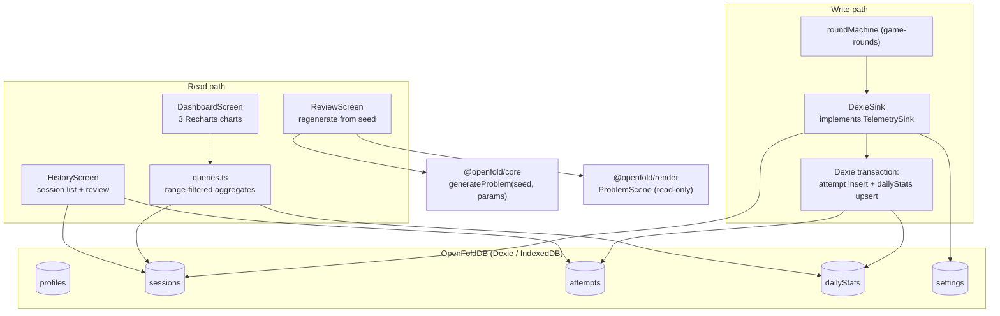
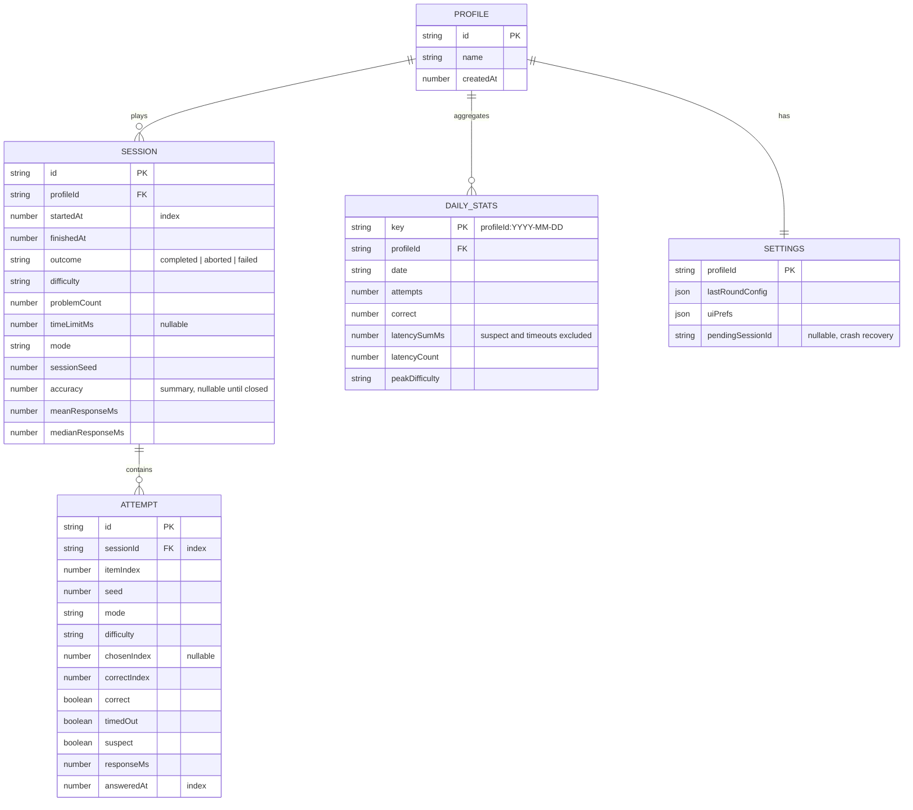

# Local Telemetry & Analytics Design

**Spec**: `.specs/features/telemetry-analytics/spec.md`
**Status**: Approved

---

## Architecture Overview

Three layers: a **Dexie database module** (schema + migrations), a **DexieSink** implementing the `TelemetrySink` interface defined by `game-rounds` (write path), and a **query/aggregation module** feeding Recharts components (read path). Aggregation is incremental: every attempt write also upserts a `dailyStats` row inside the same Dexie transaction, so dashboard reads scan ≤ 1 row per day instead of raw attempts (spec TELE-02 AC5).



### Entity model



### Dexie schema (version 1)

```typescript
class OpenFoldDB extends Dexie {
  profiles!: Table<ProfileRow, string>
  sessions!: Table<SessionRow, string>
  attempts!: Table<AttemptRow, string>
  dailyStats!: Table<DailyStatsRow, string>
  settings!: Table<SettingsRow, string>

  constructor() {
    super('openfold')
    this.version(1).stores({
      profiles: 'id',
      sessions: 'id, profileId, startedAt',
      attempts: 'id, sessionId, answeredAt',
      dailyStats: 'key, profileId, date',
      settings: 'profileId',
    })
  }
}
```

Migration policy: additive versions only; every `version(n).upgrade()` gets a test that seeds version-(n−1) data via a frozen fixture and asserts lossless transformation. The v1 task ships the harness with a trivial v0→v1 case so the pattern exists before it is needed.

### Aggregation semantics (single source of truth)

- **Accuracy** = correct / attempts, timeouts count as incorrect, suspect attempts count normally.
- **Latency aggregates** exclude `suspect` and `timedOut` rows (they measure reaction anomalies, not spatial processing).
- **Difficulty progression** = per calendar day, the highest tier with ≥ 5 attempts that day (avoids "touched hard once" spikes); ties broken toward higher tier.
- `dailyStats` is an **incremental materialization**: written transactionally with each attempt; a `rebuildDailyStats(profileId)` function recomputes from raw attempts (used by import and by the migration harness — and is itself the test oracle for incremental correctness).

### Chart mapping (Recharts)

| Chart | Source | Recharts composition |
| ----- | ------ | -------------------- |
| Mean response time over time (per difficulty) | `dailyStats` (latencySum/latencyCount) grouped by difficulty via per-difficulty stats keys — key extended to `profileId:date:difficulty` | `LineChart` + one `Line` per tier + range `XAxis` (time) |
| Accuracy per session | `sessions` (chronological, completed only) | `ComposedChart`: `Bar` accuracy + `Line` rolling mean (5-session window) |
| Difficulty progression | `dailyStats` peak tier per day | `ScatterChart` with step styling (tier as ordinal Y) |

Note the erDiagram key refinement: implementing per-difficulty latency lines requires `dailyStats.key = profileId:date:difficulty` (one row per tier per day). The `peakDifficulty` column moves to a derived query over those rows. This is the normative shape; the diagram above shows the coarse entity view.

---

## Code Reuse Analysis

### Existing Components to Leverage

| Component | Location | How to Use |
| --------- | -------- | ---------- |
| `TelemetrySink` interface + types | `apps/web/src/telemetry/TelemetrySink.ts` (game-rounds T2) | DexieSink implements it verbatim; roundMachine needs zero changes |
| `InMemorySink` tests | game-rounds T2 test suite | Contract test suite runs against BOTH sinks (shared behavioral spec) |
| `generateProblem` / `generateUnfoldProblem` | `packages/core` | Review-mode regeneration |
| `ProblemScene` | `packages/render` | Read-only review presentation (`setInteractive(false)`, `showFeedback`) |
| App shell view switching | `apps/web/src/App.tsx` (game-rounds T10) | Dashboard/History added as top-level views |

### Integration Points

| System | Integration Method |
| ------ | ------------------ |
| `game-rounds` | Swap `InMemorySink` → `DexieSink` at app boot (single injection point) |
| `desktop-shell` | None needed — IndexedDB lives in the webview (D-03); export/import uses browser download/file-picker APIs which work in Wry |

---

## Components

### db (schema module)

- **Purpose**: Dexie subclass, row types, migration scaffolding, `rebuildDailyStats`.
- **Location**: `apps/web/src/storage/db.ts`
- **Interfaces**: `OpenFoldDB` class · `openDb(): Promise<OpenFoldDB>` (creates default profile on first run) · `rebuildDailyStats(db, profileId): Promise<void>`
- **Dependencies**: dexie
- **Reuses**: types from TelemetrySink module

### DexieSink

- **Purpose**: `TelemetrySink` over `OpenFoldDB` with transactional attempt+dailyStats writes, buffered retry on failure.
- **Location**: `apps/web/src/storage/DexieSink.ts`
- **Interfaces**: implements `TelemetrySink` exactly
- **Dependencies**: db
- **Reuses**: sink contract tests from game-rounds (parameterized suite)

### queries

- **Purpose**: Read-path aggregates: `latencySeries(range, profileId)`, `accuracyPerSession(range)`, `difficultyProgression(range)`, `sessionList(page)`, `sessionDetail(id)`.
- **Location**: `apps/web/src/storage/queries.ts`
- **Interfaces**: pure async functions returning chart-ready arrays (dates pre-formatted, tiers ordinal)
- **Dependencies**: db
- **Reuses**: aggregation semantics constants shared with DexieSink (one module exports both)

### DashboardScreen / HistoryScreen / ReviewScreen

- **Purpose**: Recharts dashboard (3 charts + range filter + empty state); paginated session list with expandable attempts; read-only regenerated problem view.
- **Location**: `apps/web/src/screens/{Dashboard,History,Review}Screen.tsx`
- **Interfaces**: React components
- **Dependencies**: queries, recharts; ReviewScreen: core + render + useProblemScene
- **Reuses**: `useProblemScene` (game-rounds T6)

### exporter

- **Purpose**: Versioned JSON export envelope; validating, idempotent importer with counts.
- **Location**: `apps/web/src/storage/exporter.ts`
- **Interfaces**: `exportAll(db): Promise<Blob>` · `importFile(db, file): Promise<{added: Counts; skipped: Counts}>`
- **Dependencies**: db, `rebuildDailyStats` (imports rebuild aggregates rather than trusting the file)

---

## Data Models

Persisted rows extend the shared game-rounds types with keys:

```typescript
interface ProfileRow { id: string; name: string; createdAt: number }

interface SessionRow {
  id: string; profileId: string
  startedAt: number; finishedAt: number | null
  outcome: 'completed' | 'aborted' | 'failed'
  config: SessionConfig                    // embedded (from game-rounds types)
  summary: SessionSummary | null
}

interface AttemptRow extends AttemptRecord { id: string }   // AttemptRecord from game-rounds

interface DailyStatsRow {
  key: string          // `${profileId}:${date}:${difficulty}`
  profileId: string; date: string; difficulty: Difficulty
  attempts: number; correct: number
  latencySumMs: number; latencyCount: number
}

interface ExportEnvelope {
  format: 'openfold-export'; version: 1; exportedAt: number
  profiles: ProfileRow[]; sessions: SessionRow[]; attempts: AttemptRow[]
  settings: SettingsRow[]
}
```

**Relationships**: see erDiagram; `AttemptRow.seed + SessionRow.config` are sufficient to regenerate any problem (TELE-03).

---

## Error Handling Strategy

| Error Scenario | Handling | User Impact |
| -------------- | -------- | ----------- |
| Quota exceeded / write failure | Sink buffers in memory, retries on next write, emits warning event once | Banner: "history may be incomplete"; round unaffected |
| IndexedDB entirely unavailable | `openDb` rejects → boot falls back to InMemorySink | Persistent "history disabled this session" notice |
| Corrupt row on read | Query skips + logs row id; dashboard renders remaining data | At worst a gap, never a crash |
| Import: invalid/newer version | Typed rejection before any write (validate whole envelope first) | Error dialog with reason; DB untouched |
| Import: duplicate ids | Skip-by-id, count reported | "Added N, skipped M (already present)" |

---

## Tech Decisions (only non-obvious ones)

| Decision | Choice | Rationale |
| -------- | ------ | --------- |
| Aggregation strategy | Incremental `dailyStats` rows written transactionally with attempts | Read path independent of history size (spec: <500 ms at 10k attempts); `rebuildDailyStats` keeps a recomputation escape hatch and serves as the correctness oracle |
| dailyStats granularity | Per profile+date+difficulty (not per date) | The latency chart is split by difficulty; aggregating tiers at write time avoids raw-attempt scans for the most-viewed chart |
| Charts | Recharts (not Chart.js) | Declarative React composition matches the stack (D-01); tree-shakable; no imperative canvas lifecycle to manage alongside Three.js |
| Sink contract tests | One parameterized behavioral suite run against InMemorySink and DexieSink | Guarantees the swap at boot is behavior-preserving; prevents contract drift |
| Import trust model | Recompute `dailyStats` after import; never import aggregate rows | Aggregates are derivable; importing them would let a corrupt file poison charts silently |
| IDs | `crypto.randomUUID()` | Available in all target webviews; no dependency |
