# M7: Hardening & Release — Architecture & Design

**Milestone:** M7 | **Specification:** `spec.md` | **Status:** Design phase

## System Architecture — M7 Integration Points

```mermaid
graph TB
    subgraph Core["M1-M6: Feature-Complete App"]
        ME["React SPA + Desktop Shell<br/>(all M1-M6 features live)"]
    end

    subgraph E2E["Stream 1: E2E Testing (Playwright)"]
        direction LR
        PW1["playwright.config.ts<br/>(baseURL, screenshots, timeout)"]
        PW2["e2e/fixtures.ts<br/>(seeded problem bank,<br/>browser context)"]
        PW3["e2e/flows/**/*.test.ts<br/>(round setup, answer,<br/>results, offline)"]
        PW1 --> PW2 --> PW3
    end

    subgraph A11y["Stream 2: Accessibility (WCAG)"]
        direction LR
        AX1["axe-playwright<br/>(auto audit)"]
        AX2[".a11y/keyboard.ts<br/>(Tab order, Enter/Escape)"]
        AX3[".a11y/reducedMotion.css<br/>(@media prefers-reduced-motion)"]
        AX4[".a11y/checklist.md<br/>(manual WCAG audit)"]
        AX1 --> AX2 --> AX3 --> AX4
    end

    subgraph Perf["Stream 3: Performance Baseline"]
        direction LR
        PF1["perf/baselines.test.ts<br/>(measure latency,<br/>memory)"]
        PF2["perf/profiler.ts<br/>(heap snapshots,<br/>frame timing)"]
        PF3[".github/workflows/perf.yml<br/>(CI job, record artifacts)"]
        PF1 --> PF2 --> PF3
    end

    subgraph Release["Stream 4: Release & Docs"]
        direction LR
        REL1["RELEASING.md<br/>(v1.0.0 checklist)"]
        REL2["CI: release.yml<br/>(already exists, verify)"]
        REL3["CHANGELOG.md<br/>(v0→v1 highlights)"]
        REL4["GitHub release<br/>(artifacts + notes)"]
        REL1 --> REL2 --> REL3 --> REL4
    end

    Core -->|input| E2E
    Core -->|input| A11y
    Core -->|input| Perf
    Core -->|input| Release

    E2E -->|gate check| Gate["Gate Checks<br/>(all 4 streams pass)"]
    A11y -->|gate check| Gate
    Perf -->|gate check| Gate
    Release -->|gate check| Gate

    Gate -->|merge| Ship["v1.0.0 Release<br/>(tagged, artifacts built)"]
```



---

## Stream 1: E2E Testing (Playwright)

### Purpose
Validate user-facing flows on real browsers (Chrome, Firefox). Catch regressions across rendering, game state management, data persistence, and IPC (desktop).

### Architecture

```
e2e/
├── fixtures.ts              # Shared: browser context, problem bank, assertions
├── config/
│   ├── problems.ts          # 10 seeded problems (difficulty tiers, problem types)
│   └── constants.ts         # timeouts, selectors, test data
├── flows/
│   ├── round-setup.test.ts  # Start round, config, launch
│   ├── answer-round.test.ts # Render cube, answer all problems, submit
│   ├── review-results.test.ts # View score, dashboard, charts
│   ├── offline.test.ts      # Offline toggle (web); IndexedDB check
│   └── persistence.test.ts  # Reload mid-round, data intact
└── integration/
    ├── desktop-ipc.test.ts  # Desktop: IPC ping, data-dir persistence
    └── cross-browser.test.ts # Chrome + Firefox parity (visual, state)
```

### Key Flows

| Flow | Scope | Steps | Assertions |
|------|-------|-------|-----------|
| **Round Setup** | Web + Desktop | 1. Open app 2. Config (difficulty, count) 3. Hit Start | UI responsive, timer armed, problem 1 loaded |
| **Answer Round** | Web + Desktop | 1. See net + 5 cubes 2. Click answer 3. Repeat × count | Cube renders, click registers, feedback appears |
| **Review Results** | Web + Desktop | 1. Round ends 2. See score/time/accuracy 3. Charts | Charts render, IndexedDB persisted, no flashing |
| **Offline Toggle** | Web | 1. Enable offline mode 2. Load cached data 3. Complete round | Data from IndexedDB, no network requests |
| **Persistence** | Web | 1. Start round 2. Reload page mid-round 3. Resume | Session state recovered, problem ID unchanged |
| **Desktop IPC** | Desktop only | 1. App cold start 2. Trigger ping 3. Verify handshake | IPC roundtrip < 100 ms, data-dir exists, window state saved |

### Test Types & Locations

- **Component level (unit + @testing-library/react):** React hooks (round state machine, timer, telemetry sink)
  - Location: `apps/web/src/**/*.test.ts` (existing, keep)
  - Already covers: UI logic, event handling, store updates
  - Minimal Playwright overlap

- **Flow level (e2e via Playwright):** Real browser, real IndexedDB, real Three.js rendering
  - Location: `e2e/flows/**/*.test.ts` (new)
  - Tests: user interactions end-to-end, not internal React state
  - Avoids: pixel-perfect screenshot matching (browser/OS variance)
  - Focus: functional correctness + deterministic data checks

---

## Stream 2: Accessibility (WCAG 2.1 AA)

### Purpose
Ensure the app is usable by keyboard-only users and users with reduced-motion preferences. Meet WCAG 2.1 AA criteria (no critical violations).

### Architecture

```
.a11y/
├── checklist.md             # Manual WCAG audit checklist (section 1.4, 2.1, 2.4, 4.1)
├── keyboard.ts              # Tab order verification, keyboard event tests
├── reducedMotion.css        # @media (prefers-reduced-motion) overrides
└── e2e-audit.test.ts        # axe-core scan (runs in Playwright)

apps/web/src/
├── App.tsx                  # (update) ARIA labels, role, tabindex review
├── components/
│   ├── CubeView.tsx         # (update) keyboard controls for cube rotation
│   ├── RoundResult.tsx      # (update) focus management after round ends
│   └── RoundConfig.tsx      # (update) form accessibility (labels, fieldset)
└── styles/
    └── globals.css          # (update) :focus-visible styles
```

### Audit Scope

**Automated (axe-core):**
- Color contrast (WCAG AA minimum 4.5:1 for text)
- ARIA attributes (labels, roles, live regions)
- Form accessibility (labels, error messages, required fields)
- Image alt text (if any SVG glyphs are not pure code)

**Manual (keyboard + reduced-motion tests):**
- Tab order: Can you reach all interactive elements using only Tab/Shift+Tab?
- Keyboard controls: Enter to confirm, Escape to cancel, arrow keys for cube rotation
- Focus management: After round ends, focus moves to "Review Results" button
- Reduced-motion: Fold animation plays 1× speed (no loop), fade-ins are instant

**Documentation:**
- ARIA authoring practices guide compliance
- Known limitations documented (e.g., "3D cube rotation requires mouse/touch; keyboard equivalent: arrow keys")

---

## Stream 3: Performance Validation

### Purpose
Establish baseline latency & memory metrics, validate against PROJECT.md budgets, provide a performance report.

### Architecture

```
perf/
├── baselines.test.ts        # Measure latency (generation, render, answer submit)
├── memory.test.ts           # Heap snapshots, allocation patterns
├── profiler.ts              # Shared utilities (performance.measure, navigator.memory)
└── report.ts                # Generate markdown/JSON report

.github/workflows/
└── perf.yml                 # (new) Run perf tests, upload report as artifact
```

### Metrics & Budgets

| Metric | Budget (PROJECT.md) | Measurement Method | Gate Pass Criteria |
|--------|---------------------|-------------------|-------------------|
| **Cold start** | < 2 s | `performance.now()` from load to "app ready" | p50 < 2 s, p99 < 3 s |
| **Problem generation** | < 200 ms | `performance.measure()` seed → net+distractors | p50 < 200 ms |
| **Render frame** | 60 fps (16.7 ms) | Chrome DevTools / requestAnimationFrame timing | p50 < 20 ms, no drops |
| **Answer submission latency** | < 500 ms | click answer → feedback visible | p50 < 500 ms |
| **Idle RAM** | < 50 MB | heap snapshots after 5s idle | measured on Windows/macOS/Linux |
| **Memory during round** | < 200 MB | peak heap during round completion | measured on "normal" machine |

### Test Structure

```typescript
// perf/baselines.test.ts example
describe('Performance Baselines', () => {
  it('generates a problem in < 200ms (p50)', async () => {
    const times = []
    for (let i = 0; i < 100; i++) {
      const start = performance.now()
      generateProblem(seed + i)
      times.push(performance.now() - start)
    }
    const p50 = percentile(times, 50)
    expect(p50).toBeLessThan(200)
  })

  it('measures idle memory < 50MB', async () => {
    const heap = await measureHeap()
    expect(heap.usedJSHeapSize).toBeLessThan(50 * 1024 * 1024)
  })
})
```

### Reporting

- CI artifact: `perf-report-{timestamp}.json` (metrics + comparison to baseline)
- Markdown summary: uploaded to GitHub release notes
- Gate: Any regression > 10% flags a PR for performance review

---

## Stream 4: Release & Documentation

### Purpose
Formalize the release process, document v1.0.0 scope/gaps, automate artifact distribution.

### Architecture

```
RELEASING.md                # v1.0.0 release checklist (automation + manual)
CONTRIBUTING.md             # Dev setup, task workflow, CI/CD overview
CHANGELOG.md                # v0 (unreleased) → v1.0.0 highlights
README.md                   # (update) Known limitations, offline-only

.github/
└── workflows/
    ├── ci.yml              # (verify) typecheck + lint + test + build
    ├── release.yml         # (verify) multi-platform binary build + package
    └── perf.yml            # (new) run performance suite, upload report
```

### v1.0.0 Release Checklist (RELEASING.md)

```markdown
## Pre-release checklist (automated in CI)

- [ ] `pnpm -w test` green (coverage ≥ 90% core, ≥ 70% other)
- [ ] `pnpm -w typecheck` green
- [ ] `pnpm -w lint` green
- [ ] `pnpm -w build` green
- [ ] `cargo test -p openfold-desktop` green (all platforms in CI)
- [ ] `cargo build --release` < 10 MB (all platforms in CI)
- [ ] Playwright e2e suite green (Chrome + Firefox)
- [ ] axe-core audit pass (zero critical/serious)
- [ ] Performance baseline recorded (latency, memory)

## Manual checks (in RELEASING.md)

- [ ] CHANGELOG.md updated with v1.0.0 highlights
- [ ] README.md reflects "offline-only, no cloud, v1 limitations"
- [ ] LICENSE file includes all dependency licenses (MIT/Apache-2.0 only)
- [ ] Security scan (e.g., npm audit, cargo audit) run, no critical issues
- [ ] Docs reflect v1 gaps (no i18n, no adaptive difficulty, no installers)

## Release steps (automated in release.yml)

1. Git tag `v1.0.0`
2. CI builds all platforms (Win/macOS-x64/macOS-arm64/Linux-x64)
3. Artifacts zipped (Windows) or tar.gz (Unix)
4. Checksums recorded
5. GitHub release created with artifacts + CHANGELOG snippet
```

### Known v1 Gaps (to document)

| Gap | Rationale | v1.1+ Plan |
|-----|-----------|-----------|
| **No i18n** | Architecture ready (tutorial content as data), but no translations yet | Crowdsourced translations post-launch |
| **No adaptive difficulty** | Needs v1 usage data to calibrate IRT; deterministic tiers sufficient for MVP | Collect v1 usage data, implement IRT in v1.1 |
| **No native installers** | MSI/app/AppImage require OS-specific tooling + code signing; portable zip/tar.gz works offline | Investigate cargo-wix (Windows), properly bundled macOS .app |
| **Cross-engine determinism unverified** | WebView2 verified on Windows CI; WKWebView/WebKitGTK need manual runs | Set up macOS/Linux CI with native webview testing |
| **No cloud sync / accounts** | Out of scope; offline-first in v1 | Post-launch if demand exists |

---

## Dependency & Parallelism Analysis

### Setup Phase (Prerequisite)
- Add Playwright + axe-core to devDependencies
- Create `e2e/` directory structure and fixtures
- Create `.a11y/` directory with WCAG checklist
- Create `perf/` directory with baseline framework
- Update CI configs (add e2e, a11y, perf gates)

### Parallel Execution (4 streams, independent after setup)

| Stream | Dependencies | Duration | Can run in parallel? |
|--------|--------------|----------|----------------------|
| E2E (Playwright) | Setup complete | 8-12 hrs | YES (independent) |
| A11y (axe + keyboard) | Setup complete | 6-8 hrs | YES (independent) |
| Performance | Setup complete | 5-7 hrs | YES (independent) |
| Release & Docs | All 3 streams done | 4-6 hrs | NO (depends on results) |

**Recommended team structure:**
- 1 dev: E2E flows (Playwright)
- 1 dev: A11y audit (keyboard + axe)
- 1 dev: Performance profiling
- All 3: Release checklist & docs together (1-2 hours)

**Solo dev schedule (context-switching):**
- Hours 1-4: E2E setup + first 3 flows
- Hours 5-8: A11y keyboard mapping + axe setup
- Hours 9-12: Performance profiling + report
- Hours 13-14: Release checklist + tag/release

---

## Testing & Verification Strategy

### E2E Gate Check
```bash
pnpm exec playwright test --project=chromium --project=firefox
# Expects: all flows pass > 95%, no flaky tests after 3 runs
```

### A11y Gate Check
```bash
pnpm exec playwright test --project=a11y  # axe-core scans
pnpm test .a11y/keyboard.test.ts         # keyboard-only flow
# Expects: zero critical/serious axe violations, keyboard flow completes
```

### Performance Gate Check
```bash
pnpm test perf/
# Expects: all latency metrics within budget, memory < budgets
```

### Release Gate Check
```bash
./scripts/release-validate.sh  # (new) verifies artifacts, checksums, GitHub release
# Expects: 4 binaries (Win, macOS-x64, macOS-arm64, Linux), checksums match
```

---

## Risk Mitigations

| Risk | Mitigation |
|------|-----------|
| Playwright e2e flaky (intermittent failures) | Early real-browser testing; use waitForFunction + explicit waits, not guessed timeouts; 3-run golden-file standard |
| axe-core false positives (e.g., "missing alt text" on algorithmic SVG) | Document known false positives; manual audit as source of truth |
| Performance regression undetected (metrics become bloated) | Record baseline metrics in git; CI compares every PR; > 10% regression flags review |
| Desktop binary size creep | Already in M6 CI (measure.ps1/measure.sh); re-verify in perf stream |

---

## Success Criteria (Gate)

1. ✅ Playwright suite: Chrome + Firefox, all flows > 95% pass (no flaky retries needed)
2. ✅ axe-core: zero critical/serious violations
3. ✅ Keyboard: full round completion with keyboard only
4. ✅ Reduced-motion: no animation flashing, CSS test passes
5. ✅ Performance: latency p50 < 500 ms (answer submission), memory < 200 MB
6. ✅ Release: v1.0.0 tag + 4 platform binaries + CHANGELOG
7. ✅ CI: All gates pass (test, lint, typecheck, build, e2e, a11y, perf, release validation)

---

## Notes

- **Browser coverage:** Chrome (WebKit renderer) + Firefox (Gecko). Safari (WebKit) deferred to v1.1+ (no CI support without macOS runner, already in release.yml manual note).
- **Playwright vs. Cypress/Selenium:** Playwright chosen for speed, modern async/await API, excellent accessibility testing support (axe-playwright).
- **Reduced-motion testing:** No automated frame-rate check (flaky across hardware). Rely on CSS `@media (prefers-reduced-motion)` and manual visual verification in test output screenshots.
- **Memory profiling:** Use `navigator.memory` (Chrome-only, approximate) + manual heap snapshots (`--inspect` flag, offline analysis). Target commodity hardware: 2024 dev machine (8GB RAM base).
