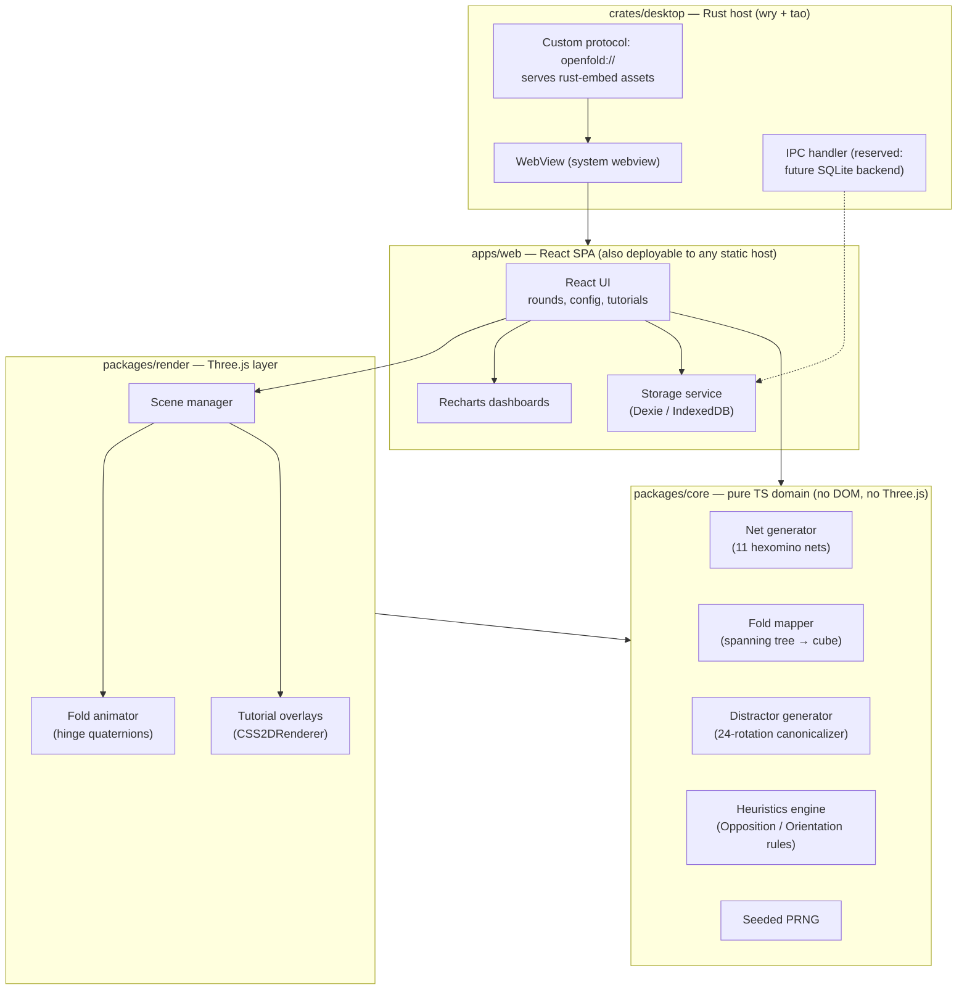

# OpenFold

**Vision:** A free, open-source, cross-platform educational simulator that trains Spatial Ability (CHC Gv factor) — specifically mental rotation and spatial visualization — through procedurally generated cube net folding/unfolding exercises.
**For:** Candidates preparing for psychometric aptitude tests (Wonderlic, DAT PAT, Bennett BMCT, military/aviation batteries), educators teaching spatial geometry, and cognitive-training researchers needing an instrumented, reproducible task environment.
**Solves:** Existing spatial-ability prep relies on static, finite image banks with no feedback loop. Learners memorize items instead of acquiring transferable spatial strategies, and get no longitudinal signal about their progress. OpenFold generates unlimited, parameterized items, teaches explicit solution heuristics, and measures progression locally.

## Goals

- **Unlimited valid items:** 100% of exercises are procedurally generated and verified correct (exactly 1 correct alternative among 5, proven distinct under cube rotation group) — zero static image banks.
- **Measurable training signal:** Users can view accuracy %, mean response latency, and difficulty progression charts over any historical window, computed entirely from local data.
- **Explicit strategy instruction:** Guided Training teaches at least two formal heuristics (Opposition Rule, Orientation Rule) with interactive 3D demonstrations, and post-answer explanations reference them.
- **Low footprint desktop:** Desktop binary (excluding system webview) < 10 MB; idle RAM of the native host process < 50 MB; cold start < 2 s on commodity hardware.
- **Total offline capability:** Every feature works with zero network access, in both browser and desktop builds.

## Tech Stack

**Core:**

- Language: TypeScript 5.x, `strict: true` (all app/domain logic)
- 3D engine: Three.js (rendering, animation, spatial math via `Quaternion`/`Matrix4`)
- UI framework: React 18+ with Vite
- Charts: Recharts (telemetry dashboards)
- Persistence: IndexedDB via Dexie 4.x (local-first, offline)
- Desktop wrapper: Rust — `wry` (webview) + `tao` (windowing) + `rust-embed` (asset bundling). **Not Tauri; not Dioxus** (see STATE.md decision D-02).

**Key dependencies:** three, react, recharts, dexie, vitest (tests), wry/tao (Rust crates).

## System Architecture (overview)

Dependency rule: `core` depends on nothing; `render` depends on `core` + three; `web` depends on both; `desktop` embeds the built `web` bundle and knows nothing about its internals.

## Scope

**v1 includes:**

- Procedural generation of cube-net fold/unfold problems (1 correct + 4 verified-incorrect 3D alternatives)
- Animated 3D folding/unfolding visualization (Three.js)
- User-parameterized rounds: difficulty tier, problem count, per-item time limit
- Guided Training: interactive tutorials for the Opposition Rule and Orientation Rule, plus rule-based answer explanations
- Local telemetry: per-attempt records, session summaries, historical charts (accuracy, latency, difficulty progression)
- Browser build (static SPA) and desktop builds for Windows, macOS, Linux via Wry

**Explicitly out of scope (v1):**

- User accounts, cloud sync, or any network features
- Multiplayer / leaderboards
- Mobile (iOS/Android) builds
- Non-cube Gv item types (paper folding, hole punching, surface development) — deferred, see STATE.md
- Static/authored item banks
- Adaptive IRT-based difficulty calibration (v1 uses deterministic difficulty tiers)

## Constraints

- Timeline: open-source, milestone-driven (see ROADMAP.md); no fixed calendar deadline
- Technical: offline-first (no runtime network dependency); TypeScript `strict` mandatory; Three.js is the sole 3D/vector math engine in the rendering layer; desktop wrapper must not be Tauri and must not be Electron
- Resources: solo-maintainer friendly — CI must gate all merges; every task independently verifiable
- Licensing: permissive OSS (MIT), all dependencies must be MIT/Apache-2.0 compatible
