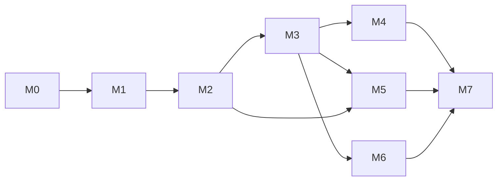

# OpenFold Roadmap

Milestones are strictly ordered by dependency; each ends with a demoable exit criterion. Feature folders under `.specs/features/` carry the detailed specs, designs, and task breakdowns.

| Milestone | Name | Features | Exit criterion (demoable) |
| --------- | ---- | -------- | ------------------------- |
| M0 | Scaffolding & CI | — (infra tasks in `procedural-engine/tasks.md` Phase 0) | `pnpm build && pnpm test` green in CI on an empty-but-wired monorepo |
| M1 | Procedural Engine | `procedural-engine` | CLI/test harness prints a seeded problem: net + 5 alternatives, exactly 1 valid, deterministic per seed |
| M2 | 3D Rendering & Animation | `rendering-3d` | Browser page shows a generated net folding into its cube; 5 answer cubes rendered; orbit works |
| M3 | Playable Rounds (browser MVP) | `game-rounds` | User configures a round, answers N problems under a timer, sees score summary |
| M4 | Telemetry & Analytics | `telemetry-analytics` | Attempts persist across reloads (IndexedDB); dashboard charts accuracy, latency, difficulty over time |
| M5 | Guided Training | `guided-training` | Interactive Opposition Rule and Orientation Rule tutorials; wrong answers get rule-based explanations |
| M6 | Desktop Shell | `desktop-shell` | Single Rust binary launches the app offline on Win/macOS/Linux; footprint budgets met |
| M7 | Hardening & Release | cross-cutting | Playwright e2e suite green; a11y pass; v1.0.0 tagged with CI-built desktop artifacts |

## Milestone detail

### M0 — Scaffolding & CI

**Goal:** A pnpm workspace + cargo workspace where every later task lands into a compiling, testable slot.
Deliverables: monorepo layout (`packages/core`, `packages/render`, `apps/web`, `crates/desktop`), TypeScript strict config, ESLint, Vitest, Vite, GitHub Actions (typecheck + lint + test + build), MIT license, README stub.

### M1 — Procedural Engine (`PROC-xx`)

**Goal:** The mathematical heart: net generation, fold mapping, distractor generation — pure TS, 100% deterministic, exhaustively unit-tested.
Risk focus: correctness of the spanning-tree fold mapper and the 24-rotation canonicalizer. Both get property-based tests (all 11 nets × symmetries fold to a valid cube; distractors never equal the answer under any rotation).

### M2 — 3D Rendering & Animation (`REND-xx`)

**Goal:** Three.js layer consuming `core` output: hierarchical fold animation, answer-option cubes, camera/interaction, overlay anchors for M5.
Risk focus: hinge hierarchy must mirror the core spanning tree exactly, or animations diverge from the mathematical model.

### M3 — Playable Rounds (`GAME-xx`)

**Goal:** The game loop: session config → problem presentation → answer capture → feedback → summary. First end-user-valuable build.

### M4 — Telemetry & Analytics (`TELE-xx`)

**Goal:** Dexie schema, storage service, attempt/session recording, Recharts dashboards, JSON export/import.
Depends on M3 (needs real attempts to record); charts render from day one via the same aggregation code used at runtime.

### M5 — Guided Training (`TUTR-xx`)

**Goal:** Educational layer: heuristics engine in `core` (already stubbed in M1), interactive step-through tutorials with 3D annotations, post-answer explanations.
Depends on M2 (overlay anchors) and M3 (feedback phase hook).

### M6 — Desktop Shell (`DESK-xx`)

**Goal:** Wry + tao host serving the embedded SPA via a custom protocol. Packaging notes per OS.
Deliberately last among features: the SPA is wrapper-agnostic, so the shell wraps a finished product.

### M7 — Hardening & Release

**Goal:** Playwright e2e over the browser build, accessibility audit (keyboard-only play, reduced-motion mode), performance validation against PROJECT.md budgets, release automation.

## Dependency graph

(M6 can start any time after M3 in parallel with M4/M5 — it only consumes the built bundle.)
